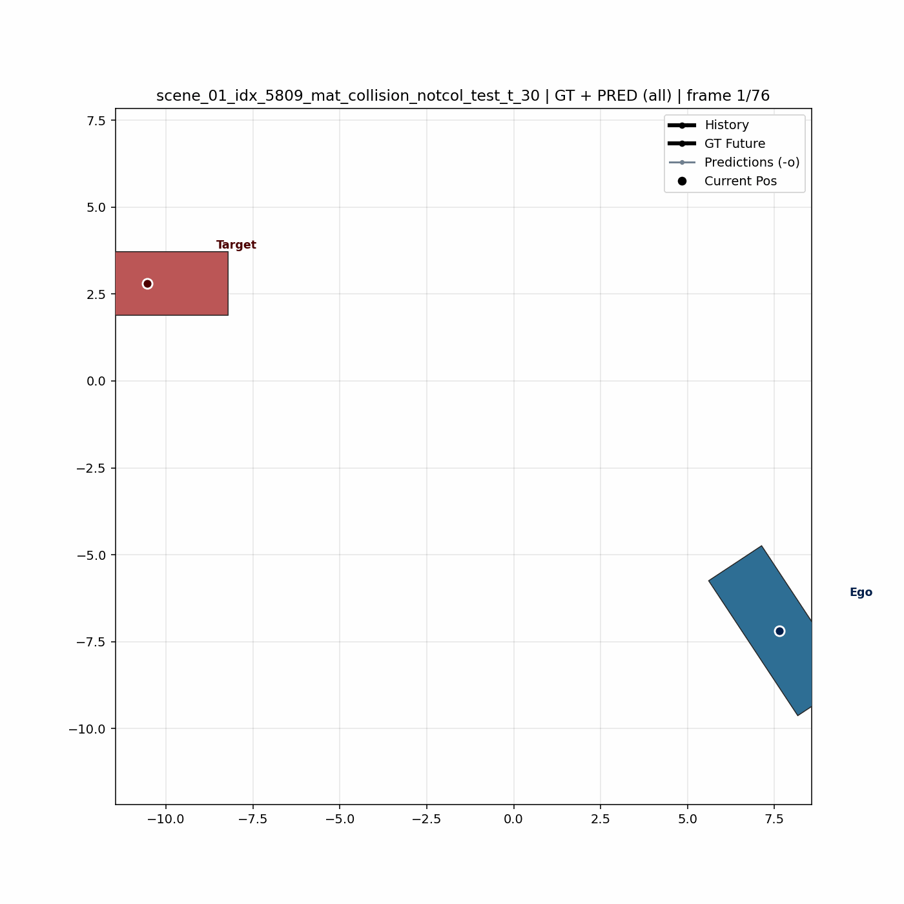
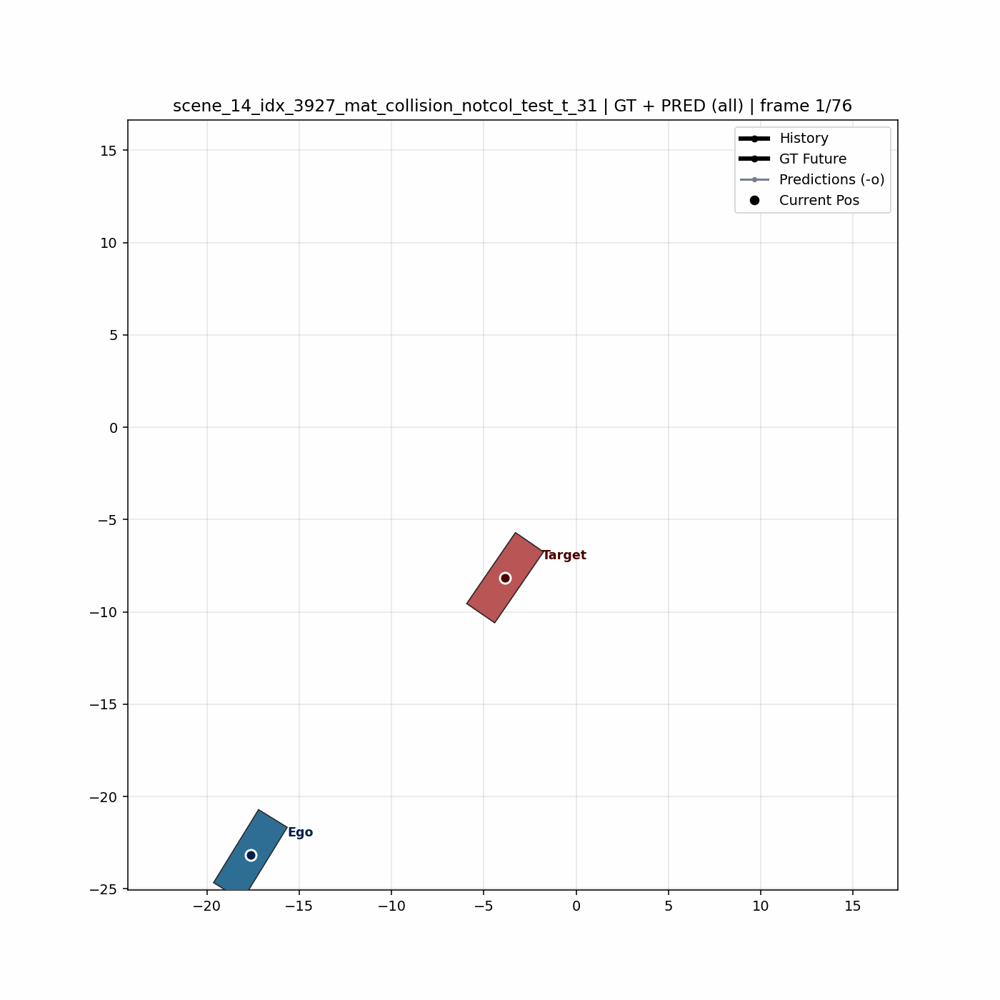
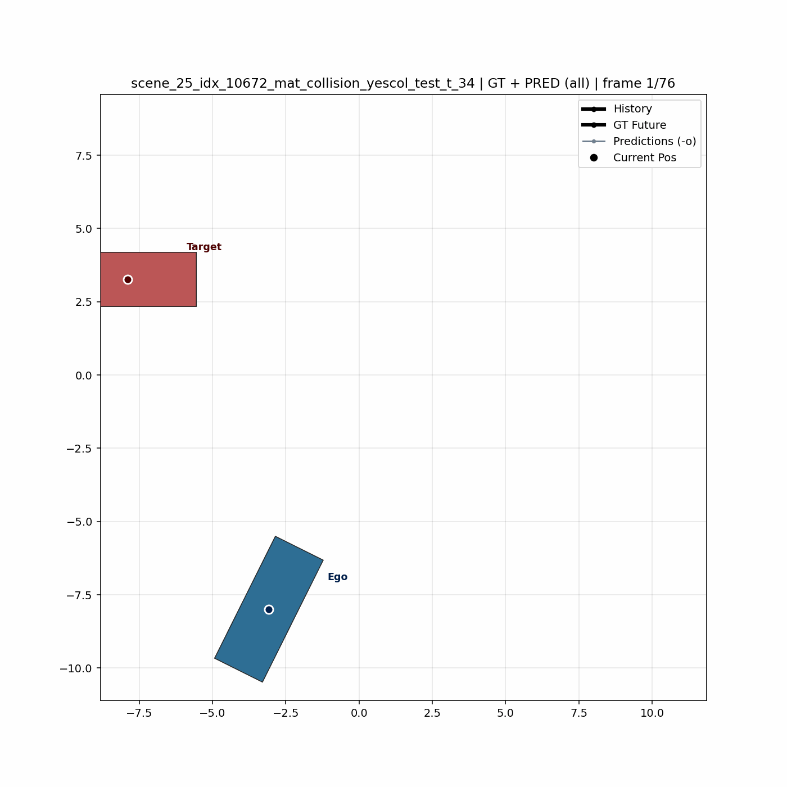
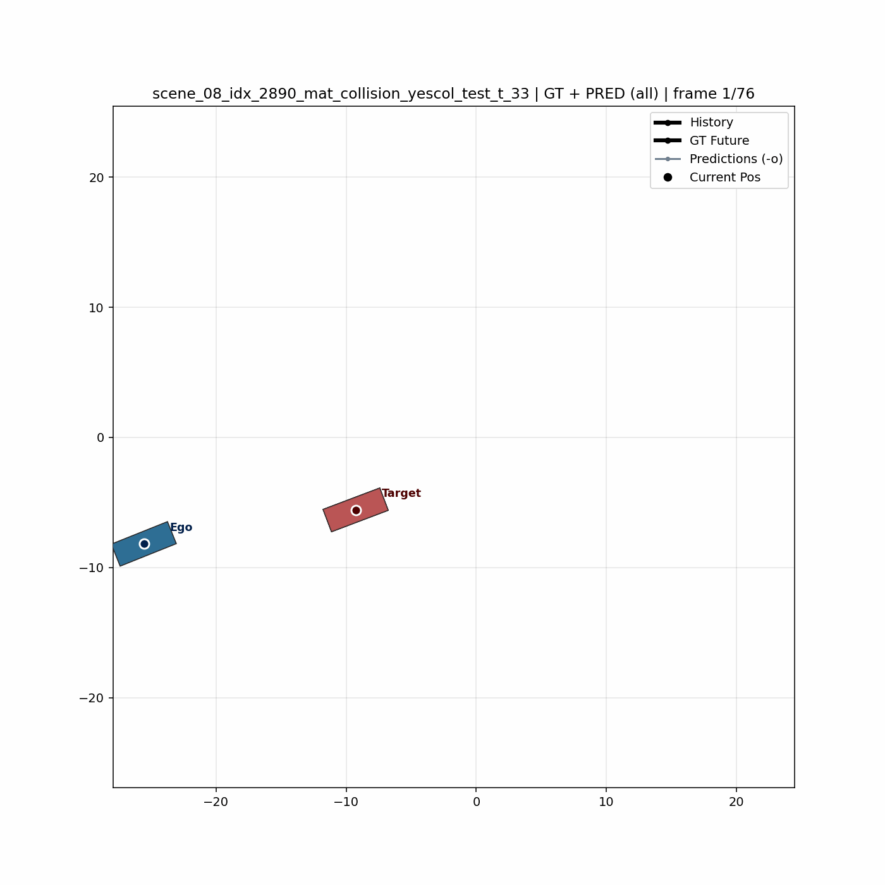

# Collision_sim

이 저장소는 MID 코드베이스와 논문을 기반으로 수정 및 확장한 프로젝트입니다.

## 데이터 케이스 (assets)

이 프로젝트는 파일명/데이터셋명에서 아래 두 가지 케이스 라벨을 사용합니다.

1. `notcol`: 비충돌 시나리오를 충돌하도록 유도한 케이스
2. `yescol`: 충돌 시나리오를 비충돌하도록 회피한 케이스

예시 assets:

| 케이스 | 예시 |
| --- | --- |
| `notcol` |  |
| `notcol` |  |
| `yescol` |  |
| `yescol` |  |

## Acknowledgement

This project was implemented and documented with reference to:

1. MID repository (base project): https://github.com/Gutianpei/MID
2. Gu et al., "Stochastic Trajectory Prediction via Motion Indeterminacy Diffusion", CVPR 2022  
   Paper: https://arxiv.org/abs/2203.13777

## Citation

If you use this project in research or publications, please cite the original MID paper:

```bibtex
@inproceedings{gu2022stochastic,
  title={Stochastic Trajectory Prediction via Motion Indeterminacy Diffusion},
  author={Gu, Tianpei and Chen, Guangyi and Li, Junlong and Lin, Chunze and Rao, Yongming and Zhou, Jie and Lu, Jiwen},
  booktitle={Proceedings of the IEEE/CVF Conference on Computer Vision and Pattern Recognition},
  pages={17113--17122},
  year={2022}
}
```
